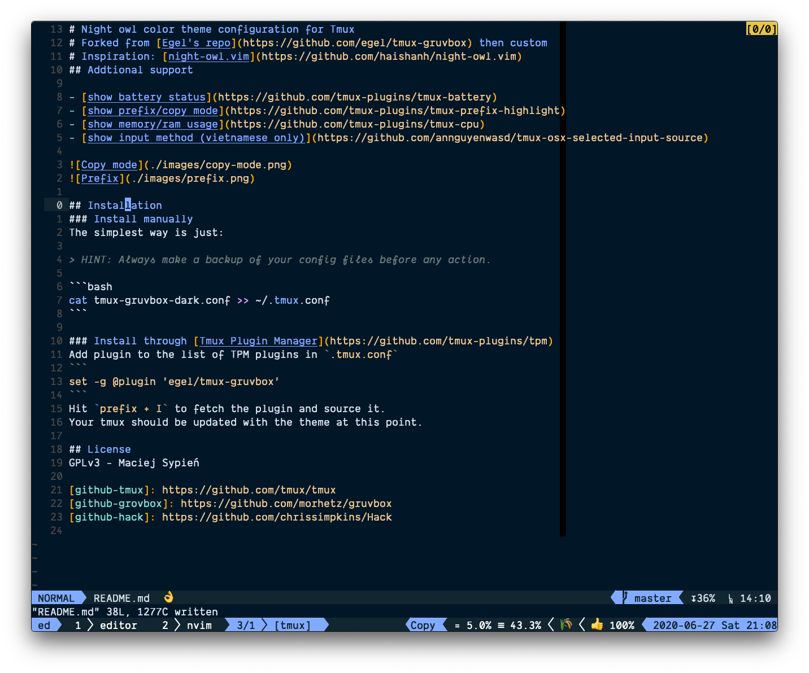

# Night owl color theme configuration for Tmux
# Forked from [Egel's repo](https://github.com/egel/tmux-gruvbox) then custom
# Inspiration: [night-owl.vim](https://github.com/haishanh/night-owl.vim)
## Addtional support

- [show battery status](https://github.com/tmux-plugins/tmux-battery)
- [show prefix/copy mode](https://github.com/tmux-plugins/tmux-prefix-highlight)
- [show memory/ram usage](https://github.com/tmux-plugins/tmux-cpu)
- [show input method (vietnamese only)](https://github.com/annguyenwasd/tmux-osx-selected-input-source)




## Installation
### Install manually
The simplest way is just:

> HINT: Always make a backup of your config files before any action.

```bash
cat tmux-night-owl-dark.conf >> ~/.tmux.conf
```

### Install through [Tmux Plugin Manager](https://github.com/tmux-plugins/tpm)
Add plugin to the list of TPM plugins in `.tmux.conf`
```
set -g @plugin 'annguyenwasd/tmux-night-owl'
```
Hit `prefix + I` to fetch the plugin and source it.
Your tmux should be updated with the theme at this point.

